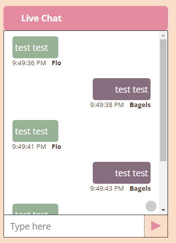

# chat-application_v2

This is the second version of my Advanced JavaScript project where all the modules and libraries are up to date. It is a fun yet simple chat application designed to be more aesthetically pleasing and using PedroTech's tutorial as a basis for the application, I have added additional quality of life improvements to the app so the end user can send and receive messages efficiently. 

I have chosen this project as a way to gain a better understanding of React, Node and Express as well as learn something new (Socket.IO).

## Description
 

### Built With

* [React.js](https://reactjs.org/)
* [Node.js](https://nodejs.org/en/)
* [Socket.IO](https://socket.io/)
* [Express](https://expressjs.com/)
* [Nodemon](https://www.npmjs.com/package/nodemon)
* [CORS](https://developer.mozilla.org/en-US/docs/Web/HTTP/CORS)
* [Coolors.co](https://coolors.co/) - Getting the colour scheme for application

## Getting Started

### Installation

Run the following commands (if you cannot run the project properly on your machine):
```
cd server
npm init
```
(for npm init, press enter to skip all the options and press enter for "Is this OK?")
Then, run the next command to install the packages:
```
npm i express nodemon socket.io cors
```

Navigate to the client folder and run this command:
```
npx create-react-app .
```

### Testing the Application

**IMPORTANT:** To run the application, ensure that you run the command ```npm start``` in both the client and server directory.

Copy/paste the localhost in a new browser and make sure you use the same Room ID for both browsers to properly send messages.

## Credit 
PedroTech's Realtime Chat Application: https://www.youtube.com/watch?v=NU-HfZY3ATQ

**NOTE:** If you are building this project from scratch, you must get rid of the React StrictMode tags in the client src folder as it duplicates the messages sent.
